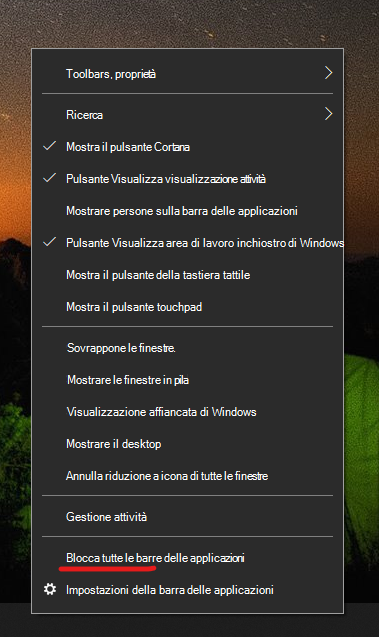

# Spostare la barra delle applicazioni su uno dei lati o nella parte superiore del desktopMove the taskbar to either side or the top of your desktop

Innanzitutto, verificare che la barra delle applicazioni sia sbloccata.First, please confirm that the taskbar is unlocked. Per scoprire se è sbloccata, fare clic con il pulsante destro del mouse su uno spazio vuoto sulla barra delle applicazioni e controllare se accanto a **Blocca la barra delle applicazioni** c’è un segno di spunta.To find out whether yours is unlocked, right-click any empty space on the taskbar and see whether **Lock the taskbar** has a checkmark next to it. Se è presente un segno di spunta, la barra delle applicazioni è bloccata e non può essere spostata.If there is a checkmark, the taskbar is locked and cannot be moved. Se si clic una volta su **Blocca la barra delle applicazioni** si sblocca e il segno di spunta viene rimosso.Clicking **Lock the taskbar** once will unlock it and remove the checkmark.

Se sono presenti più monitor che visualizzano la barra delle applicazioni, verrà visualizzato **Blocca tutte le barre delle applicazioni**.If you have multiple monitors that display the taskbar, you will see **Lock all taskbars**.

Dopo aver sbloccato la barra delle applicazioni, è possibile premere su uno spazio vuoto della barra delle applicazioni e, tenendo premuto, trascinarla nella posizione desiderata sullo schermo.Once the taskbar is unlocked, you can press and hold any empty space on the taskbar and drag it to the location you want on the screen. È anche possibile fare clic con il pulsante destro del mouse su uno spazio vuoto sulla barra delle applicazioni e passare a **[Impostazioni della barra delle applicazioni](ms-settings:taskbar?activationSource=GetHelp) > Posizione della barra delle applicazioni sullo schermo**.You can also do so by right-clicking on any empty space on the taskbar and go to **[Taskbar settings](ms-settings:taskbar?activationSource=GetHelp) > Taskbar location on screen**.
